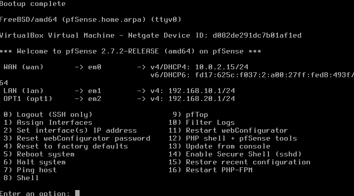
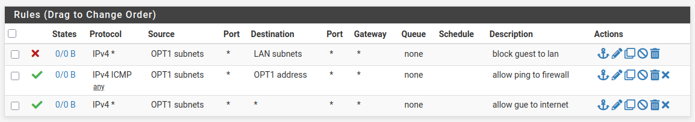
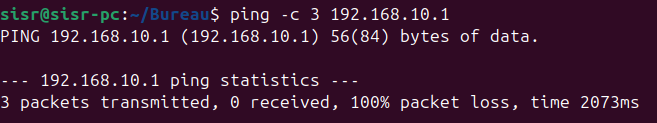

# Lab pfSense – Segmentation réseau

## Objectif

Ce projet simule la mise en place d'un réseau d'entreprise avec pfSense, virtualisé sous VirtualBox, avec pour objectif de séparer le trafic des employés de celui des invités. Le but est de garantir que les invités n'aient accès qu'à Internet, sans pouvoir atteindre les ressources internes de l'entreprise (LAN Employés).

## Architecture

- **Interface LAN** : réseau des employés, avec accès complet aux ressources internes et à Internet
- **Interface OPT1** : réseau des invités, isolé du LAN, avec accès Internet uniquement

## Technologies utilisées

- pfSense (pare-feu/routeur)
- VirtualBox (virtualisation)
- Ubuntu (postes clients de test)

## Configuration des règles de filtrage

Des règles de pare-feu ont été configurées sur l'interface OPT1 (Invités) pour bloquer tout trafic à destination du réseau LAN (Employés), tout en autorisant la sortie vers Internet.

## Tests et validation

### Test — Isolation Invités → LAN Employés
Un ping a été effectué depuis un poste du réseau Invités (OPT1) vers un poste du réseau LAN (Employés) pour valider que la règle de filtrage bloque bien cette communication.

**Résultat** :

Le ping échoue, confirmant que le réseau Invités est bien isolé du réseau interne Employés, conformément à l'objectif de segmentation.

## Résultat

- Réseau Employés isolé et protégé des accès non autorisés
- Invités ont accès à Internet uniquement, sans visibilité sur le LAN interne
- Accès LAN bloqué pour les invités, validé par test de ping

## Conclusion

Ce lab démontre une compétence clé en sécurité réseau : la séparation des flux entre un réseau de confiance (Employés) et un réseau non fiable (Invités), un principe fondamental appliqué en entreprise pour limiter la surface d'attaque interne (ex: réseau Wi-Fi invité dans une entreprise).
